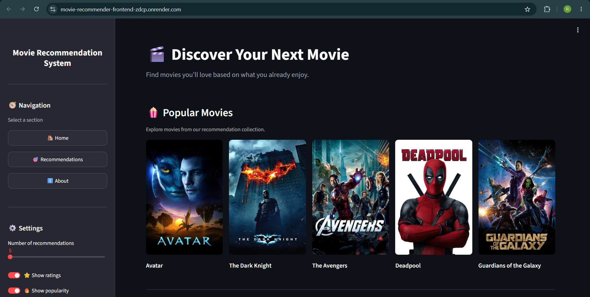
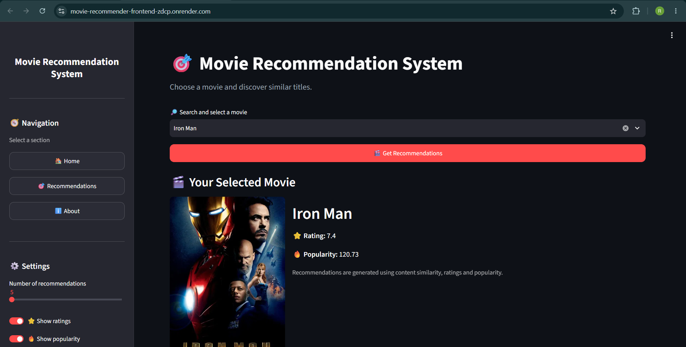
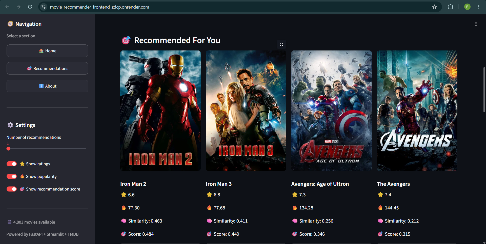
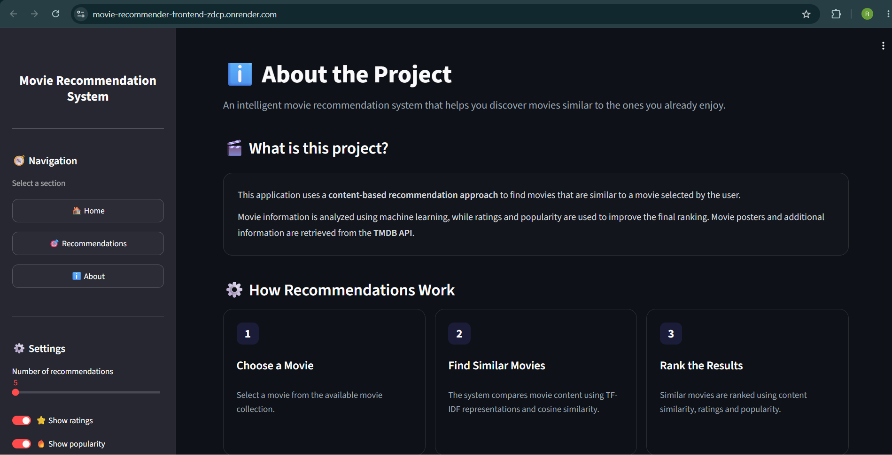

# 🎬 Movie Recommendation System

<p align="center">

  
  
  
  
  
  
  

</p>

<p align="center">
  <b>An end-to-end movie recommendation system built with Machine Learning, FastAPI, Streamlit, Docker and TMDB API.</b>
</p>

<p align="center">

  <a href="https://movie-recommender-frontend-zdcp.onrender.com/">
    
  </a>

  <a href="https://movie-recommender-backend-h1k5.onrender.com/">
    
  </a>

</p>

---

## 🌐 Live Application

### 🎨 Frontend

**Live Application:**  
https://movie-recommender-frontend-zdcp.onrender.com/

The Streamlit frontend provides the complete user interface for searching movies and viewing recommendations.

### ⚡ Backend

**FastAPI Backend:**  
https://movie-recommender-backend-h1k5.onrender.com/

The backend exposes the recommendation engine and movie-related API endpoints.

### 📖 API Documentation

FastAPI automatically provides interactive API documentation at:

```text
https://movie-recommender-backend-h1k5.onrender.com/docs
```

---

# 📌 About the Project

The **Movie Recommendation System** is an end-to-end machine learning application that recommends movies based on the movie selected by the user.

The system uses a **content-based recommendation approach** where movie metadata is transformed into TF-IDF vectors and compared using cosine similarity.

To improve the ranking, the recommendation engine combines:

- 🎯 Content similarity
- ⭐ Movie ratings
- 🔥 Movie popularity

Movie posters and additional movie information are retrieved dynamically from the **TMDB API**.

The project was designed as a complete deployable application rather than only a machine learning notebook.

---

# ✨ Key Features

- 🎬 Search and select movies
- 🎯 Content-based movie recommendations
- 🧠 TF-IDF based feature representation
- 📐 Cosine similarity
- ⭐ Movie ratings
- 🔥 Movie popularity
- 🏆 Hybrid recommendation scoring
- 🖼️ Dynamic movie posters from TMDB
- 🔎 Movie search functionality
- ⚡ FastAPI REST API
- 🎨 Interactive Streamlit frontend
- 🐳 Dockerized frontend and backend
- ☁️ Render deployment
- 🔐 Environment-variable based API key management
- 🔄 TMDB request retry mechanism
- 💾 TMDB response caching
- ⚙️ Configurable number of recommendations
- 👁️ Toggle rating, popularity and recommendation score visibility
- 📱 Responsive recommendation cards


# 🏗️ System Architecture

```text
                         USER
                           │
                           ▼
                ┌─────────────────────┐
                │  Streamlit Frontend │
                │                     │
                │ Search Movie        │
                │ Select Movie        │
                │ Display Results     │
                └──────────┬──────────┘
                           │
                           │ HTTP Request
                           ▼
                ┌─────────────────────┐
                │    FastAPI Backend  │
                │                     │
                │ Movie Routes        │
                │ Recommendation API  │
                │ TMDB API Routes     │
                └──────────┬──────────┘
                           │
                           ▼
                ┌─────────────────────┐
                │ Recommendation      │
                │ Engine              │
                │                     │
                │ TF-IDF              │
                │ Cosine Similarity   │
                │ Hybrid Ranking      │
                └──────────┬──────────┘
                           │
                           ▼
                ┌─────────────────────┐
                │ Pre-trained Models  │
                │                     │
                │ movie_dict.pkl      │
                │ tfidf.pkl           │
                │ tfidf_vectors.pkl   │
                └─────────────────────┘

                           │
                           ▼
                ┌─────────────────────┐
                │       TMDB API      │
                │                     │
                │ Posters             │
                │ Backdrops           │
                │ Movie Details       │
                └─────────────────────┘
```

---

# 🖥️ Application Screenshots

## 🏠 Home Page

The home page introduces the application and displays popular movies retrieved through TMDB.



---

## 🔎 Movie Selection

Users can search for a movie and select it from the available movie collection.



---

## 🎯 Generated Recommendations

After selecting a movie, the recommendation engine generates similar movies and displays their rating, popularity, similarity and final recommendation score.



---

## ℹ️ About Page

The About section explains the recommendation methodology and how the system ranks movies.



---

# 🧩 Project Architecture

The project is separated into frontend, backend, machine learning artifacts and deployment configuration.

```text
MOVIE-RECOMMENDATION-SYSTEM/
│
├── assets/
│   ├── about.png
│   ├── home.png
│   ├── prediction.png
│   └── select.png
│
├── backend/
│   ├── core/
│   │   ├── __init__.py
│   │   └── config.py
│   │
│   ├── routes/
│   │   ├── __init__.py
│   │   ├── movies.py
│   │   └── recommendations.py
│   │
│   ├── schemas/
│   │   ├── __init__.py
│   │   └── movie.py
│   │
│   ├── services/
│   │   ├── __init__.py
│   │   ├── recommender.py
│   │   └── tmdb.py
│   │
│   ├── __init__.py
│   └── main.py
│
├── frontend/
│   └── app.py
│
├── models/
│   ├── movie_dict.pkl
│   ├── tfidf.pkl
│   └── tfidf_vectors.pkl
│
├── .dockerignore
├── .gitignore
├── Dockerfile.backend
├── Dockerfile.frontend
├── README.md
│
├── requirements-backend.txt
├── requirements-frontend.txt
├── requirements.txt
│
├── rishit.ipynb
└── tmdb_5000_movies.csv
```

---

# ⚡ Backend

The backend is built using **FastAPI**.

FastAPI provides a clean REST API layer between the Streamlit frontend and the recommendation engine.

### Main backend components

```text
backend/
│
├── main.py
│
├── core/
│   └── config.py
│
├── routes/
│   ├── movies.py
│   └── recommendations.py
│
├── schemas/
│   └── movie.py
│
└── services/
    ├── recommender.py
    └── tmdb.py
```

### `main.py`

Initializes the FastAPI application and registers the API routes.

### `routes/`

Contains the API endpoints related to:

- Movie search
- Movie information
- Recommendations

### `services/recommender.py`

Contains the core recommendation engine.

It loads the pre-computed ML artifacts and performs:

- Movie search
- Movie lookup
- Cosine similarity
- Hybrid ranking
- Recommendation generation

### `services/tmdb.py`

Handles communication with the TMDB API.

It includes:

- Authentication
- HTTP retry strategy
- Request timeout handling
- Poster URL generation
- Backdrop URL generation
- Response caching

---

# 🎨 Frontend

The frontend is built using **Streamlit**.

It provides:

- Home page
- Movie search
- Movie selection
- Recommendation results
- Settings
- About page
- Movie posters
- Rating information
- Popularity information
- Recommendation scores

The frontend communicates with FastAPI rather than directly performing recommendation calculations.

```text
Streamlit
    │
    │ HTTP
    ▼
FastAPI
    │
    ▼
Recommendation Engine
```

---

# 🎯 Recommendation Scoring

The recommendation engine uses a weighted hybrid score.

| Component | Weight |
|-----------|-------:|
| Content Similarity | 75% |
| Rating | 20% |
| Popularity | 5% |

### Formula

```text
Final Score =
(0.75 × Content Similarity)
+
(0.20 × Rating Score)
+
(0.05 × Popularity Score)
```

The recommendation system therefore remains primarily **content-driven** instead of simply recommending the most popular movies.

---

# 🔗 TMDB API Integration

The application uses the TMDB API to retrieve additional movie information.

TMDB is used for:

- Movie posters
- Movie backdrops
- Movie titles
- Movie IDs
- Additional movie information

The API token is stored using an environment variable:

```text
TMDB_READ_ACCESS_TOKEN
```

The token is not stored in the GitHub repository.

---

# 🐳 Dockerization

The project uses separate Dockerfiles for the frontend and backend.

## Backend Dockerfile

```text
Dockerfile.backend
```

The backend container contains:

```text
Python 3.11
FastAPI
Uvicorn
Backend source code
Pre-trained recommendation models
```

Build:

```bash
docker build -f Dockerfile.backend -t movie-recommender-backend .
```

Run:

```bash
docker run --rm -p 8000:8000 --env-file .env movie-recommender-backend
```

---

## Frontend Dockerfile

```text
Dockerfile.frontend
```

The frontend container contains:

```text
Python 3.11
Streamlit
Frontend source code
Movie dataset required by the application
```

Build:

```bash
docker build -f Dockerfile.frontend -t movie-recommender-frontend .
```

Run:

```bash
docker run --rm -p 8501:8501 movie-recommender-frontend
```

---

# ☁️ Deployment

The application is deployed on **Render** using two separate services.

```text
                    GitHub Repository
                           │
             ┌─────────────┴─────────────┐
             │                           │
             ▼                           ▼
     Dockerfile.backend          Dockerfile.frontend
             │                           │
             ▼                           ▼
       Render Backend              Render Frontend
             │                           │
             │       HTTP API             │
             └───────────────◄───────────┘
```

### Backend

```text
https://movie-recommender-backend-h1k5.onrender.com
```

### Frontend

```text
https://movie-recommender-frontend-zdcp.onrender.com
```

The frontend uses the deployed backend URL through the `API_BASE_URL` environment variable.

---

# 🔐 Environment Variables

For local development, create a `.env` file:

```env
TMDB_READ_ACCESS_TOKEN=your_tmdb_read_access_token
API_BASE_URL=http://127.0.0.1:8000
```

For production, configure the environment variables through Render.

The `.env` file is excluded from Git using `.gitignore`.

---

# 📊 Dataset

The recommendation model is based on the **TMDB 5000 Movies Dataset**.

The dataset provides movie metadata used during the recommendation model development process.

The runtime application uses:

```text
tmdb_5000_movies.csv
```

The credits dataset is not required by the deployed runtime and is therefore excluded from the Docker build.

---

# 📦 Machine Learning Artifacts

The trained/pre-computed recommendation artifacts are stored in:

```text
models/
│
├── movie_dict.pkl
├── tfidf.pkl
└── tfidf_vectors.pkl
```

### `movie_dict.pkl`

Stores the processed movie information used by the recommendation engine.

### `tfidf.pkl`

Stores the fitted TF-IDF vectorizer.

### `tfidf_vectors.pkl`

Stores the pre-computed TF-IDF vectors for the movie collection.

This allows the application to use the trained representation directly during inference.

---

# 📓 Model Development

The machine learning workflow is documented in:

```text
rishit.ipynb
```

The notebook contains the development and preprocessing workflow used to create the recommendation artifacts.

The deployed application does not retrain the model on every request.

Instead:

```text
Training / Processing
        ↓
TF-IDF Vectorization
        ↓
Pre-computed Vectors
        ↓
Saved .pkl Files
        ↓
FastAPI Loads Artifacts
        ↓
Real-time Recommendations
```

---

# 📡 API Endpoints

The backend exposes several endpoints.

### Health Check

```http
GET /health
```

Used to verify that the backend service is running.

### Root

```http
GET /
```

Returns basic API information.

### Model Information

```http
GET /model-info
```

Returns information about the loaded recommendation model.

### TMDB Movie

```http
GET /tmdb/{movie_id}
```

Retrieves movie details from TMDB.

### Recommendations

```http
GET /recommendations/{movie_id}
```

Returns recommendations for the selected movie.

### Interactive API Documentation

```text
https://movie-recommender-backend-h1k5.onrender.com/docs
```

---

# 🛠️ Local Setup

## 1. Clone the Repository

```bash
git clone https://github.com/Rishit925/MOVIE-RECOMMENDATION-SYSTEM.git
```

```bash
cd MOVIE-RECOMMENDATION-SYSTEM
```

---

## 2. Create a Virtual Environment

Windows:

```bash
python -m venv venv
```

Activate:

```bash
venv\Scripts\activate
```

---

## 3. Install Dependencies

```bash
pip install -r requirements.txt
```

---

## 4. Configure Environment Variables

Create:

```text
.env
```

Add:

```env
TMDB_READ_ACCESS_TOKEN=your_tmdb_read_access_token
API_BASE_URL=http://127.0.0.1:8000
```

---

## 5. Start FastAPI

```bash
uvicorn backend.main:app --reload --port 8000
```

Backend:

```text
http://127.0.0.1:8000
```

Swagger documentation:

```text
http://127.0.0.1:8000/docs
```

---

## 6. Start Streamlit

Open another terminal:

```bash
streamlit run frontend/app.py
```

Frontend:

```text
http://localhost:8501
```

---

# 🧪 Docker Setup

### Backend

```bash
docker build -f Dockerfile.backend -t movie-recommender-backend .
```

```bash
docker run --rm -p 8000:8000 --env-file .env movie-recommender-backend
```

### Frontend

```bash
docker build -f Dockerfile.frontend -t movie-recommender-frontend .
```

```bash
docker run --rm -p 8501:8501 movie-recommender-frontend
```

---

# 💡 Example

Suppose the user selects:

```text
Iron Man
```

The recommendation engine analyzes its content representation and can return movies such as:

```text
Iron Man 2
Iron Man 3
Avengers: Age of Ultron
The Avengers
```

Each recommendation can contain:

```text
Movie
├── Rating
├── Popularity
├── Similarity
└── Final Score
```

---

# 🔄 Complete Request Flow

```text
User
 │
 ▼
Streamlit UI
 │
 │ Select movie
 ▼
FastAPI
 │
 │ Movie ID
 ▼
Recommendation Service
 │
 ├── Load movie information
 │
 ├── Get TF-IDF vector
 │
 ├── Calculate cosine similarity
 │
 ├── Select similar movies
 │
 ├── Apply rating score
 │
 ├── Apply popularity score
 │
 └── Calculate final ranking
 │
 ▼
FastAPI Response
 │
 ▼
Streamlit
 │
 ├── Movie Posters
 ├── Ratings
 ├── Popularity
 ├── Similarity
 └── Recommendation Score
```

# 🚀 Future Improvements

Some possible improvements for future versions include:

- 👤 User accounts and personalized recommendations
- 📚 Recommendation history
- ❤️ Like/dislike feedback
- 🤝 Collaborative filtering
- 🧠 Hybrid collaborative + content-based recommendations
- 🔍 More advanced semantic movie embeddings
- 🗄️ Database integration
- ⚡ Redis caching
- 🧪 Automated unit and integration tests
- 🔄 CI/CD pipeline
- 📊 Recommendation analytics
- 📈 Model monitoring
- 🔐 Authentication and authorization
- 🐳 Docker Compose for local orchestration

---

# 👨‍💻 Author

## Rishit Mahindru

**B.Tech Computer Science & Engineering**

Interested in:

- Machine Learning
- Deep Learning
- AI Engineering
- Data Science
- Backend Development
- MLOps

---

# ⭐ Project Highlights

```text
                    🎬 MOVIE RECOMMENDER
                           │
          ┌────────────────┼────────────────┐
          │                │                │
          ▼                ▼                ▼
     🤖 Machine       ⚡ FastAPI       🎨 Streamlit
      Learning          Backend          Frontend
          │                │                │
          └────────────────┼────────────────┘
                           │
                           ▼
                     🐳 Docker
                           │
                           ▼
                     ☁️ Render
                           │
                           ▼
                    🌐 Live System
```

## 📜 License

This project is created for educational and portfolio purposes.

---


